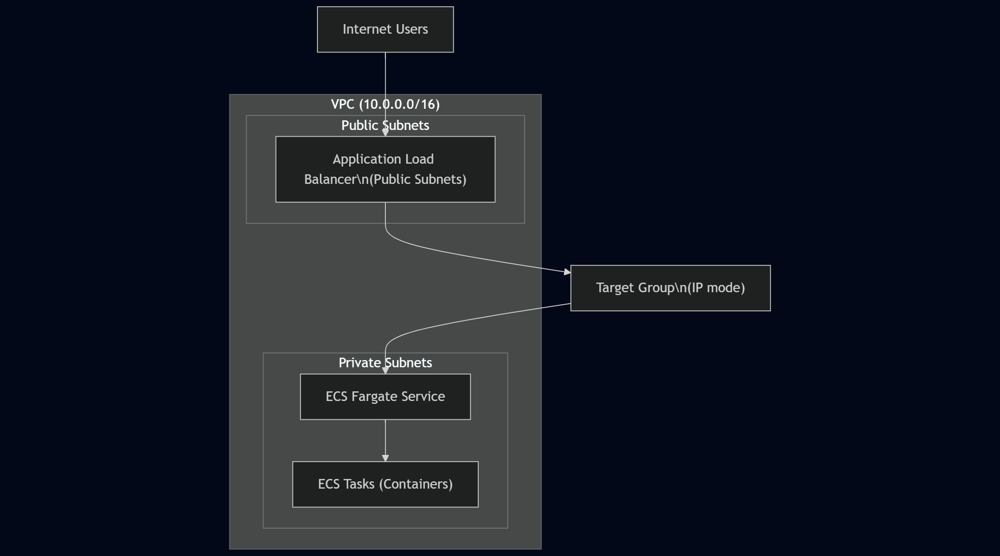

# Terraform AWS ECS Fargate Infrastructure

Production-style AWS infrastructure built with Terraform, deploying a containerized application on ECS Fargate behind an Application Load Balancer using a modular, environment-based design.

---

## 🏗️ Architecture Overview

This project provisions a cloud-native container platform on AWS using Terraform modules.  
The infrastructure is designed with security, scalability, and cost-awareness in mind.




🧰 Tech Stack

Infrastructure as Code: Terraform

Cloud Provider: AWS

Compute: ECS Fargate

Load Balancing: Application Load Balancer (ALB)

Networking: VPC with public and private subnets

IAM: Least-privilege task execution role

Logging: CloudWatch Logs

State Management: Remote backend using S3


<<<<<<< HEAD

📁 Project Structure
=======
## 📁 Project Structure

```text
>>>>>>> ca14945 (docs: improve project structure section)
terraform/
├── modules/
│   ├── vpc/        # VPC, subnets, routing, NAT
│   ├── alb/        # Application Load Balancer and target group
│   └── ecs/        # ECS cluster, task definition, service
│
└── envs/
    └── dev/        # Dev environment wiring and backend


🧠 Key Design Decisions

ECS tasks run in private subnets with no public IPs

The Application Load Balancer is the only public entry point

Target groups use IP mode, which is required for Fargate

IAM roles follow least-privilege principles

Infrastructure is fully reproducible using Terraform modules


🚀 How to Deploy

cd terraform/envs/dev
terraform init
terraform plan
terraform apply

To destroy resources:
terraform destroy


🚧 Challenges and Learnings

Clear separation between Terraform modules and environment execution

Safe management of remote state using S3

Debugging IAM credentials and AWS profiles

Incremental infrastructure build to reduce deployment risk


📖 Case Study

A detailed case study covering architecture decisions, challenges faced, and lessons learned is available here:

👉 Read the full case study


🔮 Future Improvements

HTTPS termination using ACM

Autoscaling policies for the ECS service

CI/CD pipeline for automated deployments

Blue-green deployment strategy
